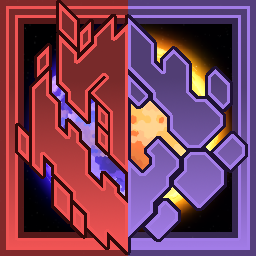

# Advanced Difficulties

A mod that overhauls the difficulty selection mechanic with better visuals, more flexible and new unique settings.

Thanks to https://github.com/lu69159/MoreCustomSettings for the modifiers that persist for each planet and some other code.

List of changes and additions:

 - Rework of difficulty selection menu, now showing variants of the enemy faction icons depending on the difficulty.
	
 - New sixth difficulty which is about x3 times harder than Eradication.
	
 - Team-colored outlines for Guardian units. It was in an official game, but has been removed since.
	
 - Extra difficulty menu, allowing you to fine-tune many stats: block/unit health/damage, unit production and cost multipliers for a specific team. Player building speed and cost. Amount of enemies that come from waves. Randomizing enemy types. Multipliers for wave cooldown, initial wave cooldown, drop zone radius, amount of waves required to capture a sector, amount of waves that will get sent in a burst.
	
 - Tier increase/decrease and force radiance. T0, T6 and T7 are planned, but far from being implemented, so if the tier cannot be decreased/increased any further, Degradation/Radiance will be applied, halving/doubling health and damage as well as slight decrease/increase in movement speed and firerate per tier. Both have 7 tiers. Also Radiance can be applied if units reach specific amount of shields. Compatible with several mods. Additional checks can be used to use T6+ units from mods like Exogenesis or New Horizon as extensions of vanilla unit branches.
	
 - On top of the extra difficulty menu you can see a global difficulty calculator which shows approximate multiplier of the game difficulty based on selected modifiers. May include silly messages. Very situational modifiers are not counted.
	
 - Full translation to English and Russian languages.
